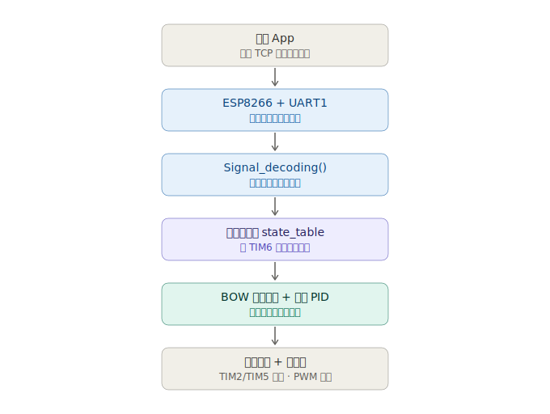
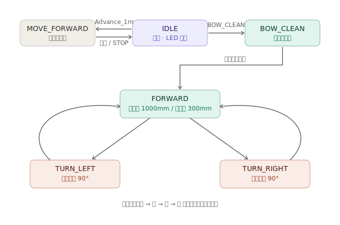
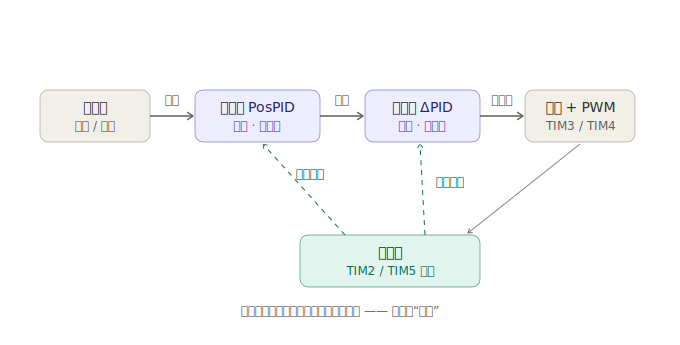

# F407 扫地机器人 — 运动控制原型

基于 **STM32F407**(HAL 库)自行搭建的扫地机器人运动控制原型,用于验证**两级状态机架构**与**串级 PID 闭环控制**,可驱动机器人走出弓字形(boustrophedon)清扫路径。

> **项目定位**:这是一台用杜邦线搭起来的功能原型,不是整合好的产品。重点放在控制软件与闭环算法本身。机械结构、整机供电、吸尘风机、避障功能均不在本次范围内,原因见[已知局限](#已知局限)。

## 项目亮点

- **两级状态机** —— 顶层任务调度 + 专门的弓字形子状态机,用**函数指针调度表**替代 `switch-case`,实现状态与执行逻辑解耦;新增运动模式无需改动调度核心。
- **串级 PID 控制** —— 位置环(外环)根据剩余编码器脉冲算出期望转速,增量式速度环(内环)再把它转换成 PWM 占空比增量;里程计反馈来自 TIM2 / TIM5 上的正交编码器。
- **非阻塞指令链路** —— 通过 **UART 空闲中断**(`ReceiveToIdle`)接收不定长指令帧;ESP8266 配置为 TCP 服务器,手机可远程下发指令。
- **确定性控制循环** —— 控制器由 **TIM6 定时中断**(约 100 Hz)驱动;直行时两轮采用"跟随慢侧"策略保持同步。

## 系统架构

从手机指令一路传到电机的信号链路:



## 状态机逻辑

顶层状态机在 `IDLE`、`MOVE_FORWARD`、`BOW_CLEAN` 之间切换。进入 `BOW_CLEAN` 后交给弓字形子状态机,通过"直行段 + 原地 90° 转向"交替来覆盖清扫区域:



## 串级 PID 控制回路

外环输出的期望转速,直接作为内环的目标值 —— 这正是串级控制的核心:



## 实测结果

车架轮子悬空(空载)的台架测试。误差均为**里程计残余口径** —— 即控制器从编码器看到的误差,而非外部基准标定的物理精度。

| 动作 | 指标 | 均值 | 最差 |
| --- | --- | --- | --- |
| 直行(目标 1000 mm) | 停位误差 | 约 2.4 mm | < 3.5 mm |
| 原地转 90° | 角度误差 | 约 0.9° | < 1.5° |

换算系数:直行 7.56 脉冲/mm,转向 10.95 脉冲/°。每个动作重复 5 组,样本量较小,数据反映的是重复性而非标定精度。

## 技术栈

- **MCU**:STM32F407(Cortex-M4),STM32 HAL
- **工具链**:CMake + arm-none-eabi-gcc,由 STM32CubeMX 生成配置,CLion 开发
- **外设**:TIM2/TIM5(编码器模式)、TIM3/TIM4(电机 PWM)、TIM6(控制循环时基)、USART1(ESP8266 通信)
- **通信**:ESP8266 经 AT 指令配置为 TCP 服务器

## 目录结构

```
Core/Src/
  main.c              启动与主循环
  State machine.c     顶层状态机(函数指针表)
  BOW.c               弓字形子状态机
  PID.c               位置环 + 速度环串级 PID
  ESP8266.c           WiFi 指令链路、帧解析
  moto.c, tim.c, ...  外设初始化
Core/Inc/             头文件
Drivers/              ST HAL + CMSIS(随仓库附带,clone 后可直接编译)
docs/                 架构与逻辑图
```

## 已知局限

以下是受原型硬件条件限制、本次刻意未实现的部分:

- **无避障**:杜邦线搭的车架没有传感器安装位,供电余量也不够,因此 `STATE_AVOID` 分支为空实现。
- **子状态未接全**:`BOW_STATE_LATERAL`、`BOW_STATE_BACK_TURN`、`BOW_STATE_DONE` 已在枚举中声明,但尚未接入调度表;目前平移用一段短 `FORWARD` 代替,清扫循环也没有终止条件。
- **未带载、未做物理标定**:上述数据均为空载里程计残余误差;带载行为与外部基准下的定位精度尚未测定。
- **控制路径中残留调试 `printf`**:若干 `printf` 位于 10 ms 控制循环和中断里,会引入延迟,后续应改为异步/标志位日志方案。
